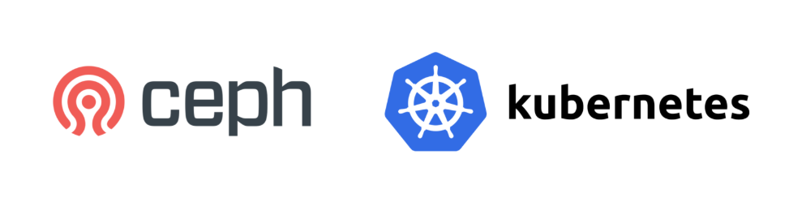
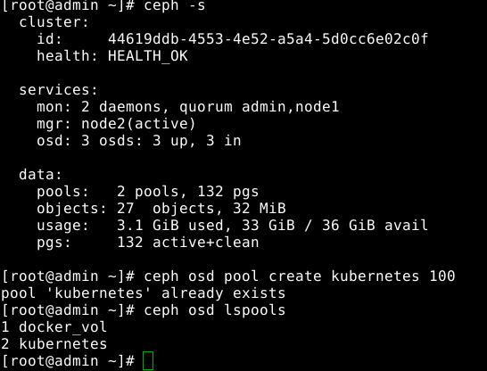
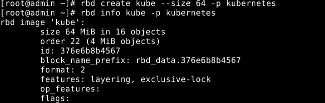
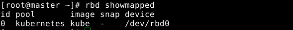
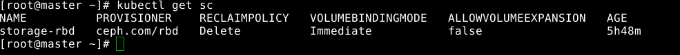
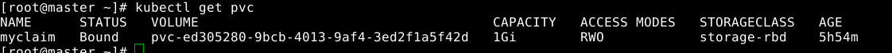

# Integration of Ceph with Kubernetes

This blog is about the integration of ceph with kubernetes. Kubernetes needs persistent storage for application to to maintain the data even after pod fails or deleted. This storage may be storage devices attached to cluster shared by NFS, storage solutions provided by cloud providers. We are considering Ceph here. Before dive into actual process for integration, lets see some basic like what ceph, kubernetes is.



## What is kubernetes?
Kubernetes is an open source orchestration tool developed by Google for managing microservices or containerized applications across a distributed cluster of nodes. Kubernetes provides highly resilient infrastructure with zero downtime deployment capabilities, automatic rollback, scaling, and self-healing of containers (which consists of auto-placement, auto-restart, auto-replication , and scaling of containers on the basis of CPU usage).

The main objective of Kubernetes is to hide the complexity of managing a fleet of containers by providing REST APIs for the required functionalities. Kubernetes is portable in nature, meaning it can run on various public or private cloud platforms such as AWS, Azure, OpenStack, or Apache Mesos. It can also run on bare metal machines.

## What is Ceph?

Ceph is opensource software defined storage platform. Ceph provides reliable and clustered storage solution. It is highly scalable to exabytelevel, operates without single point of failure and it is free. It also provides combined interface for block, object and file-level storage.

## Pre-requisites
- Kubernetes cluster
- Ceph cluster

## How to do it?
### On Ceph admin
Lets see our ceph cluster up and running by ceph -s comamnd. Now we need to create a pool and image in it for kubernetes storage where we share it with kubernetes client to use.
```
$ ceph -s
$ ceph osd pool create kubernetes 100
$ ceph osd lspools
```


Now we need image to create in kubernetes pool we just created. We are naming image "kube". And see the information of image we created.



For kubernetes to access the pool and images we created here on ceph cluster, needs some permission. So we provide it by copying ceph.conf and admin keyring.  (Although it not advised to copy the admin keyring. For better practice keyring with some permission for desired pool is need share).
```
$scp /etc/ceph/ceph.conf root@master:~
$scp /etc/ceph/ceph.client.admin.keyring root@master:~
```
## On kubernetes master
To make kubernetes master as ceph client we need to follow some steps:
- Install ceph-common packages
- Move ceph.conf and admin keyring to the /etc/ceph/ directory
Now we can run ceph commands on kubernetes master. Moving further, we need to map our rbd image here. First enable the rbdmap service
```
$ systemctl enable rbdmap
$ rbd map kube -p kubernetes
$ rbd showmapped
```
Note: If the rbdmap enabling fails, try removing rbdmap file from /etc/ceph directory. Depending upon which ceph version and OS you are using, this mapping is not done simply running these commands. You need to load rbd modules into kernel by modeprobe command. Also disable some feature of rbd by rbd feature disable command.



### Connecting Ceph and kubernetes
Kubernetes to use ceph storage as backend, kubernetes needs to talk with ceph(not in general) via external storage plugin as this provision is not include in official kube-control-manager image. So we need either to customize the kube-control-manager image or use plugin- rbd-provisioner. In this blog, we are using external plugin. Lets create rbd-provisioner in kube-system namespace with RBAC. Before creating deployment check if rbd-provisioner has same image of ceph version as yours by running following command:
```
$ docker pull quay.io/external_storage/rbd-provisioner:latest
$ docker history quay.io/external_storage/rbd-provisioner:latest | grep CEPH_VERSION
```
Now create deployment by running following script. This will create service account RBAC, Role biding etc.
```
cat <<EOF | kubectl create -n kube-system -f -
kind: ClusterRole
apiVersion: rbac.authorization.k8s.io/v1
metadata:
  name: rbd-provisioner
rules:
  - apiGroups: [""]
    resources: ["persistentvolumes"]
    verbs: ["get", "list", "watch", "create", "delete"]
  - apiGroups: [""]
    resources: ["persistentvolumeclaims"]
    verbs: ["get", "list", "watch", "update"]
  - apiGroups: ["storage.k8s.io"]
    resources: ["storageclasses"]
    verbs: ["get", "list", "watch"]
  - apiGroups: [""]
    resources: ["events"]
    verbs: ["create", "update", "patch"]
  - apiGroups: [""]
    resources: ["services"]
    resourceNames: ["kube-dns","coredns"]
    verbs: ["list", "get"]
  - apiGroups: [""]
    resources: ["endpoints"]
    verbs: ["get", "list", "watch", "create", "update", "patch"]
---
kind: ClusterRoleBinding
apiVersion: rbac.authorization.k8s.io/v1
metadata:
  name: rbd-provisioner
subjects:
  - kind: ServiceAccount
    name: rbd-provisioner
    namespace: kube-system
roleRef:
  kind: ClusterRole
  name: rbd-provisioner
  apiGroup: rbac.authorization.k8s.io
---
apiVersion: rbac.authorization.k8s.io/v1beta1
kind: Role
metadata:
  name: rbd-provisioner
rules:
- apiGroups: [""]
  resources: ["secrets"]
  verbs: ["get"]
---
apiVersion: rbac.authorization.k8s.io/v1
kind: RoleBinding
metadata:
  name: rbd-provisioner
roleRef:
  apiGroup: rbac.authorization.k8s.io
  kind: Role
  name: rbd-provisioner
subjects:
- kind: ServiceAccount
  name: rbd-provisioner
  namespace: kube-system
---
apiVersion: v1
kind: ServiceAccount
metadata:
  name: rbd-provisioner
---
apiVersion: apps/v1
kind: Deployment
metadata:
  name: rbd-provisioner
spec:
  replicas: 1
  selector:
    matchLabels:
      app: rbd-provisioner
  strategy:
    type: Recreate
  template:
    metadata:
      labels:
        app: rbd-provisioner
    spec:
      containers:
      - name: rbd-provisioner
        image: "quay.io/external_storage/rbd-provisioner:latest"
        env:
        - name: PROVISIONER_NAME
          value: ceph.com/rbd
      serviceAccount: rbd-provisioner
EOF
```
check  if rbd-provisioner pod in running after few minutes by running following command:
```
kubectl get pods -l app=rbd-provisioner -n kube-system
```
RBD volume provisioner needs admin key from Ceph to provision storage. To get the admin key from Ceph cluster use this command:
```
ceph --cluster ceph auth get-key client.admin
```
Now create Kubernetes secret with this key
```
 kubectl create secret generic ceph-secret \
    --type="kubernetes.io/rbd" \
    --from-literal=key='COPY-YOUR-ADMIN-KEY-HERE' \
    --namespace=kube-system
```
Note: If keyring other than admin also created for pool permissions, then we also need to create secret for the same. We are going to use admin keyring and admin user for creating kubernetes resources like storage class, pvc etc. 
 - Remember to add monitor ip addresses to following file
 To get monitor addresses run following command:
 ```
 $ ceph mon dump
 ```
 Now Lets create storage-class named storage-rbd:
```
apiVersion: storage.k8s.io/v1
kind: StorageClass
metadata:
  name: storage-rbd
provisioner: ceph.com/rbd
parameters:
  monitors: <MONITOR_IP_1>:6789, <MONITOR_IP_2>:6789
  adminId: admin
  adminSecretName: ceph-secret
  adminSecretNamespace: kube-system
  pool: kubernetes
  userId: admin
  userSecretName: ceph-secret
  userSecretNamespace: kube-system
  imageFormat: "2"
  imageFeatures: layering
```
Save this in storage-class.yml file and run following command:
```
$ kubectl create -f storage-class.yml
$ kubctl get sc
```



And the last step is to create a simple PVC. Save following in file pvc.yml
```
kind: PersistentVolumeClaim
apiVersion: v1
metadata:
  name: myclaim
spec:
  accessModes:
    - ReadWriteOnce
  resources:
    requests:
      storage: 1Gi
  storageClassName: storage-rbd

  ```
  and run 
  ```
  $ kubectl create -f pvc.yml
  ```
  
  
  
  ## Summary:
That's it !! We created the persistent storage for kubernetes from ceph. Use this pvc to create pv and pod whatever you like.

Hope you enjoyed this blog. Happy Ceph-ing!! 
